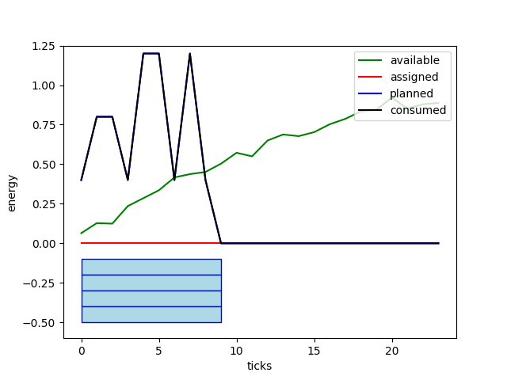
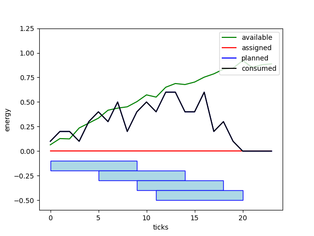

# Household energy optimization with VOLTTRON™ framework

### Authors
* [@enthyp](https://github.com/enthyp)
* [@DzikiLamer](https://github.com/DzikiLamer)
* [@tomekzaw](https://github.com/tomekzaw)

### 1. Volttron platform installation
Run the following commands:
 * `git clone https://github.com/VOLTTRON/volttron --branch releases/7.x`
 * `cd volttron`
 * `python bootstrap.py`
 * `source env/bin/activate`
 * `vcfg` - to run a single instance of Volttron platform select **Y** to all boolean options presented and default values for all others. This should install Volttron Central module into your environment.
 * `./start-volttron`

You can then verify if your agents are live by running command `vctl status`. You should see a list of all agents running in the system.

Then you shall proceed to [https://hostname:8443/admin/login.html](https://hostname:8443/admin/login.html) (hostname is what you've chosen during configuration) and create a user account. You can then login to Volttron Central [https://hostname:8443/vc/index.html](https://hostname:8443/vc/index.html).

### 2. Project description
We use Volttron platform as communication medium for multiple agents that cooperate to reduce household energy consumption.

For the sake of simplicity we consider a single home equipped with a set of photovoltaic (PV) panels and a number of energy receivers, such as e.g. washing machines. Each such installation is represented by a single agent in the system.

##### 2.1. Central unit
We introduce a single **Hub** agent responsible for scheduling working periods of power consumers. This agent receives data from both suppliers and consumers. On that basis it assigns time slots for the devices that minimize the following quantity:

*α* * energy_to_buy + *β* * energy_oversupply + *θ* * average_delay

For large values of *α* this encourages usage of free energy from the panels.

##### 2.2. Power supply
Agents responsible for communication with PV panels use Volttron pub-sub functionality to publish power supply data, i.e. power and voltage. As of time being, dummy data is used. We assume that PV panels provide us with an estimate supply for the next 6 hours, on which we base our optimisation.

##### 2.3. Power consumption
Power consumer agents publish requests for power to the Hub agent. They transfer the following information:
 * requested energy profile – how much power [kWh] is required over a period of time
 * maximal delay for the device initialization

##### 2.4. Integration with VOLTTRON™
**HubAgent** keeps an instance of `Hub` object:
```py
lookahead = 6*4
scheduler = BruteForceScheduler(lookahead)
self.hub = Hub(scheduler, self.vip.pubsub)
```
It subscribes on power supply and consumption topics:
```py
self.vip.pubsub.subscribe(peer='pubsub',
    prefix="devices/AGH/D17/Panel/profile",
    callback=self.on_source_request)

self.vip.pubsub.subscribe(peer='pubsub',
    prefix="devices/AGH/D17/Device/request",
    callback=self.on_device_request)
```
Then it feeds the `Hub` object with all incoming messages:
```py
def on_source_request(self, peer, sender, bus, topic, headers, message):
    message[0]['profile'] = np.array(message[0]['profile'])
    self.hub.update_source_profile(message[0]['device'], message[0]['profile'])

def on_device_request(self, peer, sender, bus, topic, headers, message):
    message[0]['profile'] = np.array(message[0]['profile'])
    request = Request(message[0]['id'], message[0]['device'],
                    message[0]['profile'], message[0]['timeout'])
    self.hub.add_request(request)
```
And starts a thread responsible for periodic triggering the `Hub` object's computations:
```py
def routine(self):
    while True:
        try:
            self.hub.tick()
            self.report_results()
        except Exception as e:
            print(e)
        time.sleep(1)
```

Power supply data comes from **SolarPanel** agent. It publishes simulated solar power profiles to the topic, which **HubAgent** is subscribed to. The `weather_factor` ranges between 0.3 and 1.0, depending on weather data obtained with `pyowm` library.
```py
while True:
    for i in range(24*4):
        if i%4 == 0:
            self.set_weather_factor()

        profile = self.simulate_solar_profile(i)
        request = {
            'device': 'SolarAgent',
            'profile': list(profile),
            'timeout': 0,
            'id': 0
        }

        self.vip.pubsub.publish('pubsub', "devices/AGH/D17/Panel/profile", message=[request])
        time.sleep(1)
```

**WashingAgent** acts as a washing machine. It publishes a profile of energy to be consumed, which, after being received by **HubAgent**, will be used for scheduling:
```py
request = {
    'device': 'WashingMachine1',
    'profile': [0.1, 0.2, 0.3, 0.3, 0.2, 0.2, 0.4],
    'timeout': 15,
    'id': random.getrandbits(128)
}

self.vip.pubsub.publish('pubsub', "devices/AGH/D17/Device/request", message=[request])

```

### 3. Examples
Energy consumption of single execution of one device over a period of time is called a profile. Profiles are one-dimensional arrays of floating point numbers, where each sample represents average energy usage in a single time unit (e.g. 15 minutes).
```py
dishwasher_profile = np.array([0.1, 0.2, 0.2, 0.1, 0.3, 0.3, 0.1, 0.3, 0.1])
```
Profiles can also represent estimated energy production, e.g. of a solar panel:
```py
solar_panel_profile = np.array([0, 0, 0.08, 0.17, 0.23, 0.36, 0.40, 0.41, 0.42, 0.39])
```
The intention of single execution of a device is called a request. Request consists of an unique identifer, device's name, device's energy profile and maximal execution delay called timeout. Immediate start (with no delay) is represented by zero timeout.
```py
request = Request(request_id=1342, device_name='dishwasher1', profile=dishwasher_profile, timeout=10)
```

Different planning strategies are encapsulated as schedulers. Schedulers implement `schedule` method that accepts a profile of available energy with a list of waiting requests and returns the optimal execution plan. Currently there are three available schedulers:
* ``NoDelayScheduler`` returns the most trivial execution plan that runs all pending requests without any delay.
```py
scheduler = NoDelayScheduler()
```
* ``BruteForceScheduler`` finds the best combination of delays by checking all possible delays for all requests. Please note that this scheduler is very resource-hungry.
```py
scheduler = BruteForceScheduler(lookahead=20)
```
* ``LinearProgrammingScheduler`` reduces scheduling problem to Mixed Integer Programming instance and finds the optimal solution using ILP solver.
```py
scheduler = LinearProgrammingScheduler(lookahead=20)
```
Both ``BruteForceScheduler`` and ``LinearProgrammingScheduler`` need to be parametrized with a number of ticks to plan ahead. Each request will start in `request.timeout` ticks and end before `scheduler.lookahead` ticks.

Execution plan is represented in a form of dictionary where keys are the requests' identifiers and values are the calculated delays for corresponding requests.
```py
{1342: 2, 1343: 0, 1344: 5}
```

Energy source's profiles and device's requests are transferred to a single hub. Hub is responsible for accepting requests, preparing the execution plan and sending launch permits to the devices in the appropriate time. Hub must be initialized with an instance of scheduler.
```py
hub = Hub(scheduler)
```
When an updated profile of energy source is published, `update_source_profile` method should be called:
```py
hub.update_source_profile(source_name='solarpanel1', profile=solar_panel_profile)
```
When a new request is received, `add_request` method has to be called.
```py
hub.add_request(request1)
```
When adding multiple requests one-by-one, you may turn off autoscheduling by adding `autoschedule=False` flag.
```py
for request in requests:
    hub.add_request(request, autoschedule=False)
...
hub.schedule()
```
Alternatively, you may use `add_requests` method that runs the scheduler only once.
```py
hub.add_requests([request2, request3, request4])
```
You may also temporarily use different scheduling strategy by passing other scheduler instance, e.g. for comparision purposes.
```py
hub.schedule_with(NoDelayScheduler())
```
In order to simulate the passage of time, the `tick` must be called. Every tick launches jobs that should start in the current tick and decreases other waiting requests' timeouts by 1.
```py
hub.tick()
```
When using hub object in a VOLTTRON™ agent it is necessary to call `tick` method periodically:
```py
from volttron.platform.scheduling import cron

@Core.schedule(cron('*/5 * * * *'))
def cron_function(self):
   self.hub.tick()
```

<div style="page-break-after: always;"></div>

### 4. Results

Without optimization | With optimization
-- | --
|  |  |

Without optimization | With optimization
-- | --
|  |  |

Without optimization | With optimization
-- | --
|  |  |


